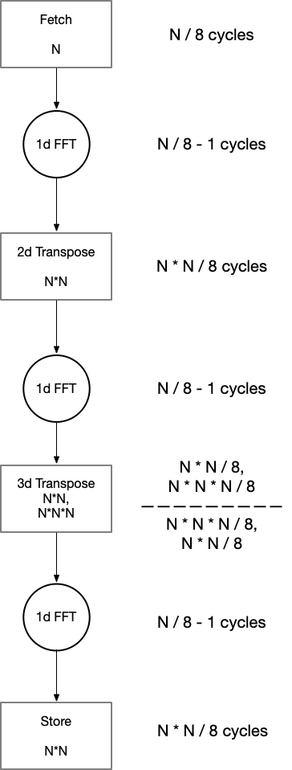

# Modelling the performance of FFT3d

Performance of FFT3d is dependent on the performance of its building blocks - FFT1d kernels.

## Modelling Latency of FFT3d Design

Developing an OpenCL 3d FFT kernel design requires transferring N$`^3`$ points from the host CPU to the DDR (global) memory via the PCIe bus, transforming the data and finally, transferring the results back to the host CPU. Each stage mentioned incurs latency, therefore, these can be categorized into:

1. PCIe Latency to transfer data between Host CPU to DDR Memory of the FPGA board.
2. DDR memory access and transfer latency
3. Kernel execution latency

### PCIe Latency

This can be modelled as (incomplete):

| # SP Points | PCIe Est (ms) | PCIe Write (ms) Measured | PCIe Read (ms) Measured |
|:-----------:|:-------------:|:---------------------------:|:--------------------------:|
| 32^3        | 0.031         | 0.105                       | 0.110                      |
| 64^3        | 0.253         | 0.44                        | 0.43                       |
| 128^3       | 2.03          | 2.75                        | 2.75                       |
| 256^3       | 16.24         | 21.3                        | 21.3                       |

SP = complex single precision floating point

PCIe Latency is measured by timing the blocking `clEnqueueWriteBuffer ` and `clEnqueueReadBuffer` calls over an average of 1000 iterations.

### DDR Memory access and transfer latency

Latency to acces DDR4 operating at 2400 MT/s incurs a latency of 240 cycles. (incomplete).

### Kernel Execution latency

The following figure illustrates the kernels of the 3d FFT. The expressions within the kernels denote the size of the buffers required to perform the operations specified by the name of the kernel. The arrows are connections between the kernels, which are created using channels. Buffering adds latency to the pipeline, which is indicated as number of cycles required across every kernel. In this model, only a single lane of the design is considered i.e., a kernel reads data from a bank of memory to stores into another forming a single lane of the pipeline.

The 2d transposition requires $`\frac{N^2}{8}`$ cycles to buffer N$`^2`$ points and another $`\frac{N^2}{8}`$ to output them. This is because the pipeline processes 8 complex single precision floating points in every stage of the pipeline. This stage, however, adds only a latency of $`\frac{N^2}{8}`$; besides the first write to the buffer every other stage is overlapping with others.

The 3d transpose is not pipelined therefore has 2 distinct read and write phases, denoted by the dashes. Additional 2d transpositions are required as intermediate buffers before storing and loading from the 3d buffer that adds further $`\frac{N^2}{8}`$ cycles of latency each.

### Total Latency

The total latency in cycles, can therefore, be expressed using the following equations:

This is a simplification of the delay contributed by the buffers as given in the figure. Assuming a clock frequency of 300 MHz, the pipeline latency can be estimated to be approximately:

|  N$`^3`$  | Latency$`_{singlelane}`$(ms) |
|:-----:|:-----------------------:|
| 32^3  | 0.029                   |
| 64^3  | 0.226                   |
| 128^3 | 1.776                   |
| 256^3 | 14.09                   |
