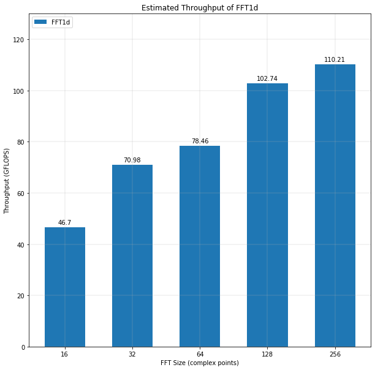

# Modelling the performance of FFT3d

Performance of FFT3d is dependent on the performance of its building blocks - FFT1d kernels.

## Modelling Throughput of FFT1d Kernel

FFT1d kernel modelled here can be found in the Intel OpenCL Design Samples. The design follows the radix 22 FFT architecture, which consists of the following:

1. logN radix-2 butterflies
2. trivial rotations at every even stage
3. non-trivial rotations at every odd stage. This is the twiddle factor multiplication computed after the stage's butterfly.
4. shuffling using shift registers

In order to calculate an N-point FFT, the design inputs 8 complex points per cycle in a bit reversed order. This requires `N / 8` cycles to store the N points into a shift register. Each point requires `logN` stages to complete the transformation. After a delay of `N / 8 - 1` cycles, 8 distinct complex points are output per cycle for `N / 8` cycles for the N transformed points.

### Butterfly

- FFT kernel performs radix-2 butterflies. Considering 8 points of input, 4 parallel butterflies are performed at every stage.

- There are `logN stages` i.e. `logN * 4` butterflies.

#### Radix-2 butterfly

- 2 complex floating points as input and output.

- Floating point addition of the complex points for the first output point and floating subtraction for the second. Considering these are complex points, this makes for 2 additions and 2 subtractions per butterfly.

Therefore, each stage has `4 * 2` floating point additions and `4 * 2` floating point subtractions, with a total of:

        logN * 8 floating point additions 
        logN * 8 floating point subtractions

### Complex Rotations

As mentioned above, every odd stage until `logN -1` stages perform a complex rotation. This involves multiplying the points with the twiddle factors. The twiddle factors are pre-calculated and stored; every stage looks up the value based on the stage and the index values. The number of complex rotations in a N-point FFT can be expressed using this formula:

/2)\rfloor)

In a complex rotation of 8 input points, every point except Point 0 and Point 4 are multiplied with distinct twiddle factors, since these points are multiplied by 1. Complex multiplication follows the formula:

(a&plus;bi)=(xa-yb)&plus;(xb&plus;ya)i)

Each complex multiplication comprises of 4 floating point multiplications, 1 floating point subtraction and 1 floating point addition as described in the code sample below.

        float2 comp_mult(float2 a, float2 b) {
                float2 res;
                res.x = a.x * b.x - a.y * b.y;
                res.y = a.x * b.y + a.y * b.x;
                return res;
        }

The number of floating point operations:

        floor((logN - 1) / 2) complex rot * 6 mult per rot * 6 flops per multiplication 
/2)*36\rfloor)

This can be mapped to two dot product computations of size 2. For the 6 complex multiplications in a complex rotation, this is a total of 12 dot products (of size 2). Each dot product is implemented by a specific hardened floating point dot product DSP. Considering the size of dot product is 2, 2 DSPs are required. The total number of DSPs required for all complex rotations of N point FFT can be mapped by the formula:

        floor((logN - 1) / 2) rot * 6 mult * 2 dot products * 2 size of a dot product

/2)*24\rfloor)
### DSP Usage

Total number of DSPs required by N-point FFT:

&plus;\lfloor((logN&space;-&space;1)&space;/&space;2)\rfloor*24)

Estimating DSP required for different FFT sizes:

| FFT Size | # DSPs |
|:--------:|:------:|
|    16    |   88   |
|    32    |   128  |
|    64    |   144  |
|    128   |   184  |
|    256   |   200  |

### Throughput

Total number of floating point operations is a total of the number of butterflies and the number of complex rotations:

        num_flops = ((logN * 16) + floor((logN - 1) / 2) * 36) 

Considering logN stages are pipelined, for maximum frequency:

        throughput = num_flops * clock_freq
                  = ((logN * 16) + floor((logN - 1) / 2) * 6)  * clock_freq

Modelled for clock frequency of 467 MHz assuming hyperflex is turned on.

**Note**: The FFT1d building block kernel used to implement FFT3d is the one provided in the Intel's design samples. The input and the output to the FFT1d kernel are both in bit-reversed order, the latter entails the need to perform another bit reversal to obtain the standard FFT output.
